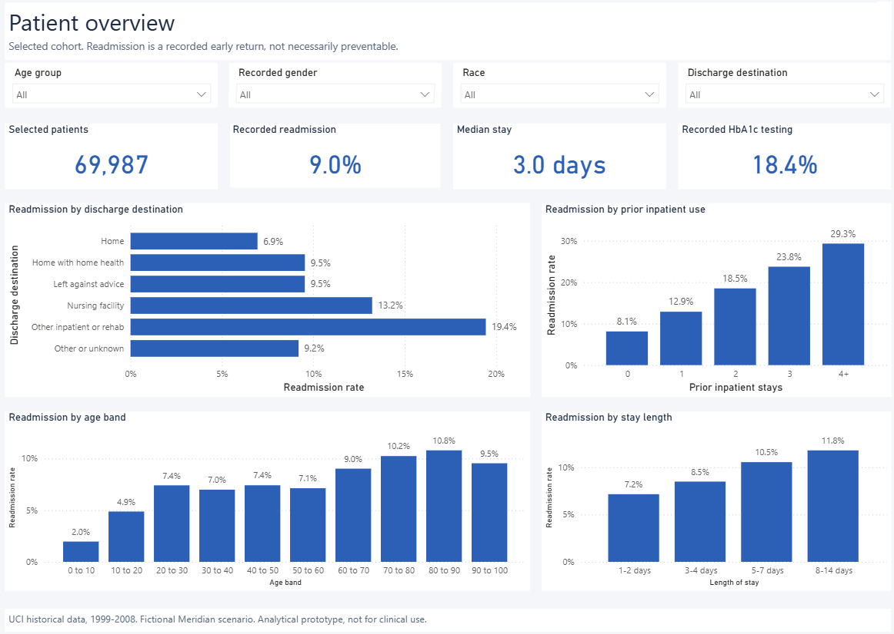

# 30-Day Readmissions: Power BI Report

A seven-page Power BI report built on the [readmissions case study](https://github.com/Ghenomenon/readmissions-case-study). It is a native Power BI project (PBIP), so every page, visual and DAX measure is stored as readable text.



> **Not for clinical use.** The risk model is a retrospective portfolio prototype. It has not been clinically validated or approved for patient-care decisions.

## Pages

1. Patient overview: cohort, readmission, length of stay and HbA1c testing, with age, gender, race and discharge slicers.
2. Patient patterns and HbA1c: diagnosis and recorded testing variation.
3. Model performance: full test-set AUC, average precision, Brier score, ROC with a chance line, calibration and odds ratios.
4. Follow-up capacity: capture and precision at each capacity level, with a random-selection baseline.
5. Subgroup performance: observed rate, mean predicted risk, flagged share and recall by race and age.
6. Illustrative business case: hypothetical costs under three scenarios.
7. Sources and methods.

The risk threshold is set once on all 20,997 test patients, so slicers never move it. At the default 20% capacity the report shows 4,200 flagged patients, 699 captured readmissions and 37.1% recall. These match the case study and the portfolio site.

## Open it

The report needs patient-level data, which is not published here. You rebuild it locally from the public source data.

1. Clone [readmissions-case-study](https://github.com/Ghenomenon/readmissions-case-study), add the UCI data and run `python run_all.py`. The dashboard data lands in `outputs/powerbi/dashboard_data/`.
2. Point this report at that folder:

```powershell
.\Set-DataFolder.ps1 -DataPath "C:\path\to\readmissions-case-study\outputs\powerbi\dashboard_data"
```

   Or open the report and set the `DataFolder` parameter in Transform data > Manage parameters.

3. Open `Readmissions.pbip` in Power BI Desktop and select Refresh.

## Data source and licence

Data: [Diabetes 130-US Hospitals for Years 1999–2008](https://doi.org/10.24432/C5230J) by John Clore, Krzysztof Cios, Jon DeShazo and Beata Strack, UCI Machine Learning Repository, licensed under [CC BY 4.0](https://creativecommons.org/licenses/by/4.0/). The records were cleaned, grouped and scored for this project. UCI and the dataset creators do not endorse this work. Meridian Health Network is fictional and the costs are hypothetical.

Report files: MIT licence (see `LICENSE`).

[Portfolio](https://chigozie-nkwopara.netlify.app/readmissions-case-study) · [Analysis code](https://github.com/Ghenomenon/readmissions-case-study)
